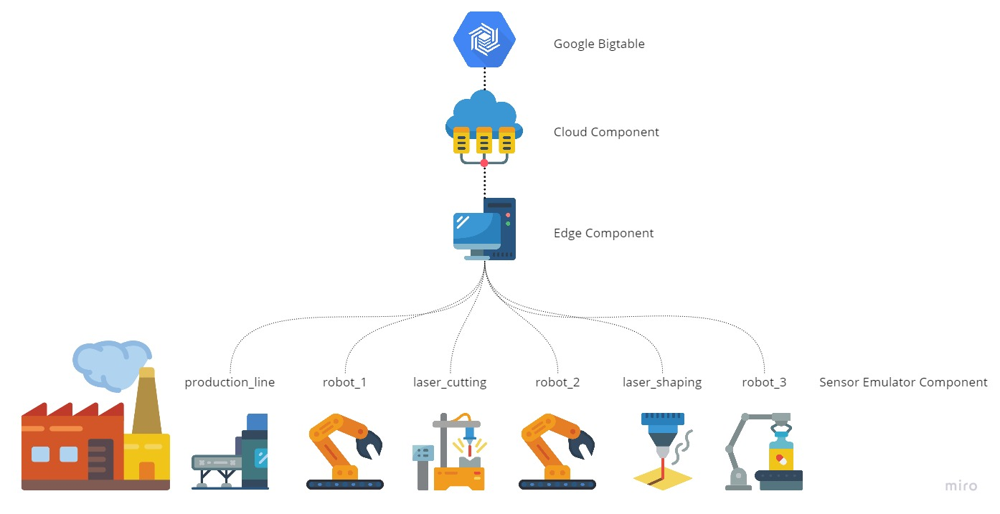

# What is this?
This is the git repository for the project assignment of the module "Fog Computing" held at the TU Berlin in Summer Semester 2021. The goal of this assignment is to implement fog related network communication by ourselfes to come in touch with the fog-specific challenges. We where free in choosing the exact application and environment we want to implement it in. We decided to implement three components. The Emulator, Edge and Cloud component. The Emulator emulates different sensors and send data to the Edge component. The edge component buffers these data and send them to the Cloud component when available. The Cloud component receives the sensor data send by the edge and write them into Bigtable. Periodically, data operations are performed on the Bigtable dataset and calculations are send back to the Edge component.

The Cloud component runs in a Virtual Machine hosted on the Google Cloud Plattform. The other components can run locally.

Icons made by <a href="https://www.flaticon.com/authors/smashicons" title="Smashicons">Smashicons</a> from <a href="https://www.flaticon.com/" title="Flaticon">www.flaticon.com</a>

# Deploy Infrastructure
The Cloud-side infrastructure is created with means of Infrastructure as Code (IaC) with the help of Terraform. During the creation and connection the key `~/.ssh/id_rsa` will be used as the ssh key. All needed dependencies and packages are automatically installed on the cloud machine during the creation.

## Prerequisitions on the local machine

1. Install the [gcloud sdk](https://cloud.google.com/sdk/docs/install#optional_install_the_latest_google_cloud_client_libraries)
2. Configure it with `gcloud init`
3. Set the default login mechanism for gcloud `gcloud auth application-default login`
4. Configure the project id at top of the terraform main.tf according to your gcp project id
5. run `terraform apply` to create the infrastructure

At the end the public IP of the created cloud vm will be displayed.

## Prerequisitions on the cloud machine
Now there are a few things to do on the cloud vm that have to be done manually.

1. Login to the machine with `ssh fogcomputing@public.ip` the ssh key should be choosen accordingly when it is not the default one
2. run `gcloud init` as already done before on the local machine
3. run `gcloud auth application-default login` 
4. clone the git repository with `git clone https://github.com/cfab20/fc-project.git`
5. change directory `cd fc-project`

# Run the setup

1. At the remote machine start the cloud component with: `python3 cloud.py`
2. Open two terminals at the local machine
3. run the sensor emulator with `python3 device_emulator.py`
4. change the public ip address in the edge.py file to the public ip of the cloud server 
5. run the edge component with `python3 edge.py` 

# What will happen?
The Emulator will generate multiple fake sensor data per minute (can be configured in the `device_connections.json`) that will be send via a local pub/sub ZeroMQ connection to the Edge component. 
The Edge component listen to the specific device topics and receives them by establishing a ZeroMQ sub connection. 
To check the availability of the Cloud component a heartbeat mechanism is implemented. It uses ZeroMQ in Request/Reply mode to achieve this. When the heartbeat fails, the sensor data are written to a temporary file (`cached_data.txt`) to cache them. When the heartbeat checks starts to be successfull, the chached data is send to the Cloud component as well as the currently received sensor data. For this a ZeroMQ Pub/Sub connection is used. The Edge publishes the device toppics with the different sensor sets. The Cloud subscribes to the device toppics and continously reads them. When new sensor data is available, the Cloud component consumes them and commit the data to the Bigtable database. Preiodically, the Cloud component will fetch the sensor data from a specific device that where added during the current hour and calcuate the average over them, which is then send back to the Edge component.
